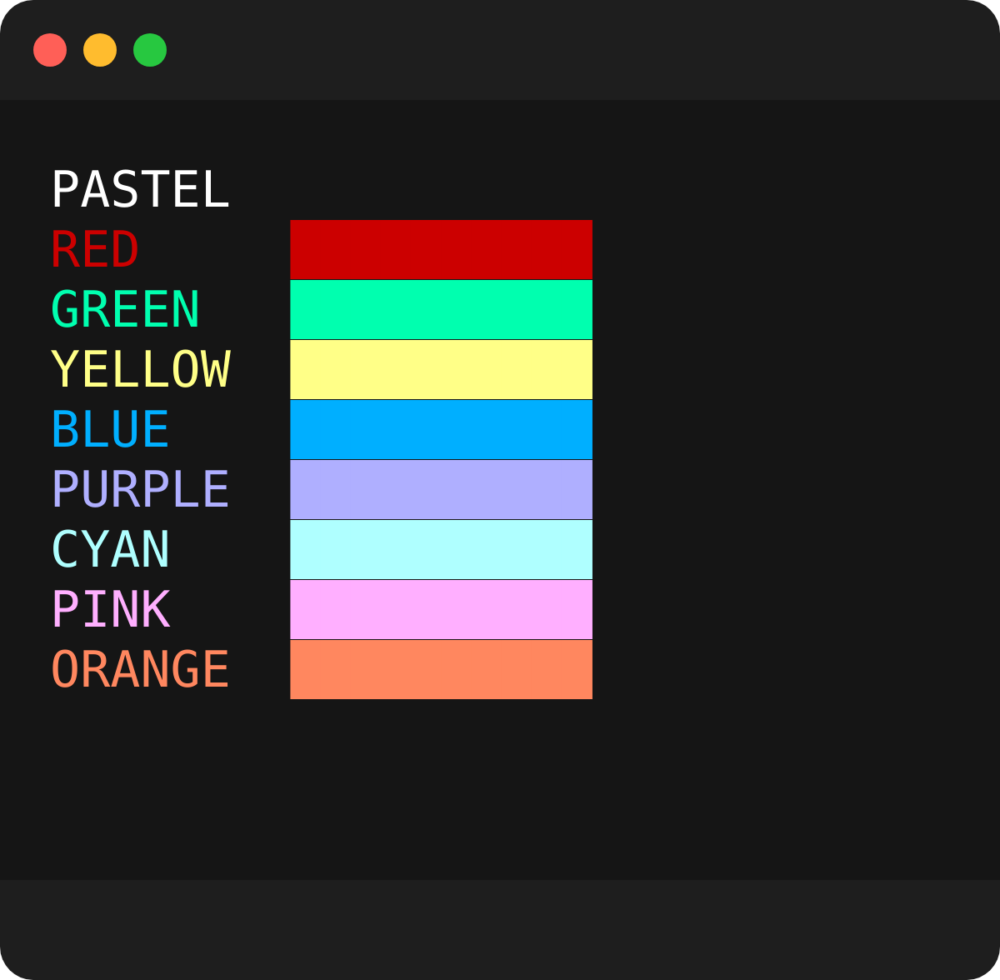

# styl3

themeable cli coloring

# features

- built-in themes available
- built-in decorators (bold, italic, hidden, underline, strikeout and inverted)
- supports hex, rgb, or ansi color codes
- supports custom colors
- easy and flexible api

# themes

5 unique built-in themes to get you started on easy cli styling  
[](https://github.com/tool3/shellfie)

<div>
  
  
</div>
<div>
  
  
  
</div>

## usage

```javascript
const style = require('styl3');
const s = style();

console.log(s.red`this will be a default red`);
// access a theme specifically
console.log(s.pastel.green`this will be a pastel green`);

const ss = style({ theme: 'pastel' });
// now `ss.green` points to the pastel green
// allowing to change theme for the entire cli with one string
console.log(ss.green`also a pastel green`);

// supports custom hex
console.log(ss.hex('#de5285')`this will be a slick pink`);
// and rgb
console.log(ss.rgb(15, 106, 251)`this will be a rich blue`);
```


# decorators

decorators are characters used to wrap a word and give it decorating features,
such as bold, italic, underline, strikeout, inverted and italic.

more than one decorator can be applied to a word

## map

```javascript
{
  bold: '*',
  underline: '!',
  dim: '~',
  hidden: '#',
  invert: '@',
  blink: '^',
  italic: '%',
  strikeout: '$'
}
```

## usage

```javascript
const style = require('styl3');
const s = style({ theme: 'pastel' });

// use decorators for bold, underline etc...
console.log(s.red`lush *BOLD* @RED@`);
// double decoratros
console.log(s.cyan`this is !*important*!`);
console.log(s.green`viva la %italia%`);
console.log(s.pink`address: ~you@somewhere.earth~`);
```


you can also provide your own custom decorators map:

```javascript
const style = require('styl3');
const s = style({ theme: 'pastel', decorators: { bold: '_' } });

// use custom decorators
console.log(s.red`this will now be _BOLD_`);
```

you can also provide your own color theme:

```javascript
const style = require('styl3');
const custom = style({
  theme: 'custom',
  colors: {
    custom: {
      red: '#750404',
      green: '#1b7504',
      yellow: '#929605',
      blue: '#041382',
      purple: '#620182',
      cyan: '#027678',
      pink: '#a3039b',
      orange: '#b37202',
    },
  },
});

// use custom colors
console.log(s.green`this will be with #1b7504 color`);
```
