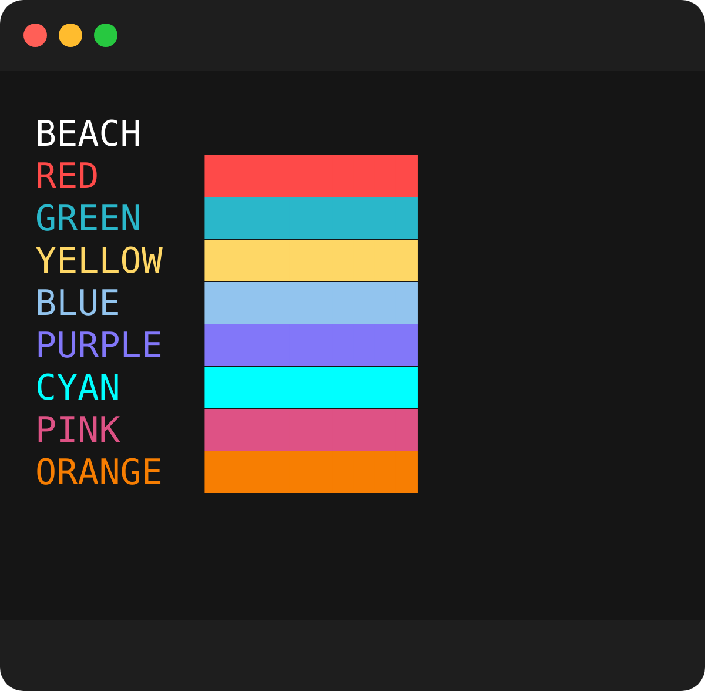

# styl3
cli color manager

# features
- built-in themes available
- built-in decorators (bold, italic, hidden, underline, strikeout and inverted)
- supports hex, rgb, or ansi color codes
- supports custom colors
- easy and flexible api

# themes
5 unique built-in themes to get you started on easy cli styling    
[](https://github.com/tool3/shellfie)  


     

## usage
```javascript
const style = require('styl3');
const s = style();
// use as tag functions
console.log(s.red`this will be red`)
// access a theme specifically
console.log(s.pastel.green`this will be a pastel green`)

const ss = style({theme: 'pastel'});
// now `ss.green` points to the pastel green
// allowing to change theme for the entire cli with one string
console.log(ss.green`this will also be a pastel green`)

// supports custom hex
console.log(ss.hex('#de5285')`this will be a slick pink`)
// and rgb
console.log(ss.rgb(15, 106, 251)`this will be a rich blue`)
```

# decorators
decorators are characters used to wrap a word and give it decorating features,
such as bold, italic, underline, strikeout, inverted and italic.

more than one decorator can be applied to a word

## map
```javascript
{
  bold: '*',
  underline: '!',
  dim: '~',
  hidden: '#',
  invert: '@',
  blink: '^',
  italic: '%',
  strikeout: '$'
}
```

## usage
```javascript
const style = require('styl3');
const s = style({theme: 'lush'});

// use decorators for bold, underline etc...
console.log(s.red`this will be a lush *BOLD* @RED@`)
console.log(s.cyan`!this will all be underlined!`)
console.log(s.green`$59$$ 29$ !`)
```
