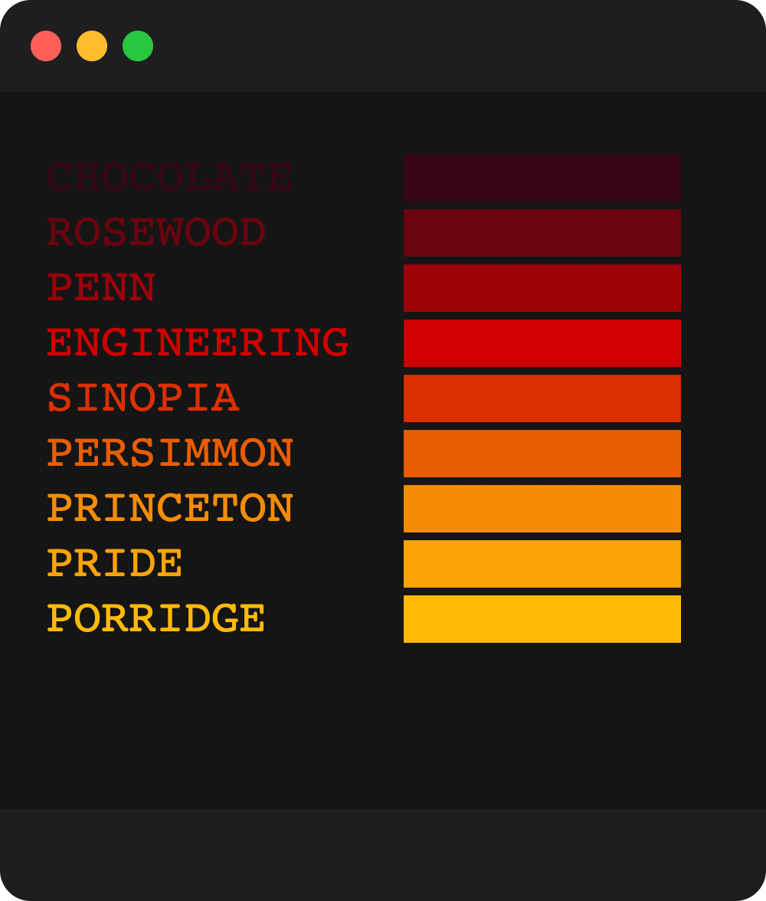
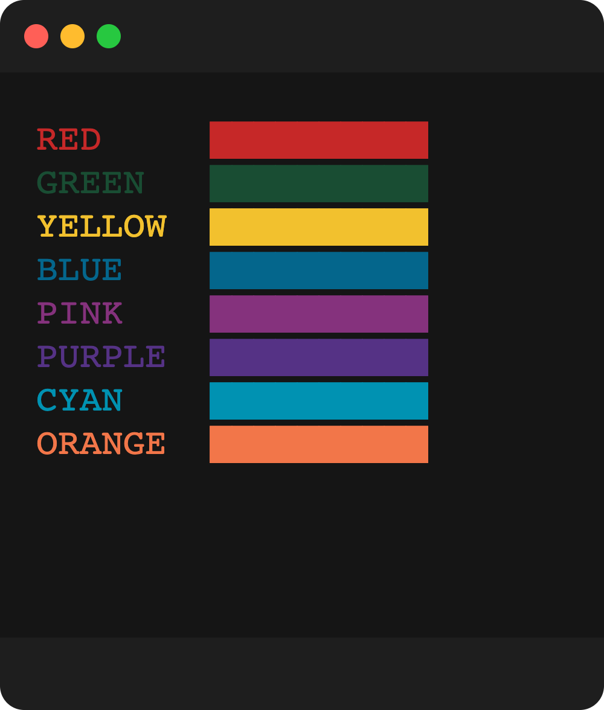
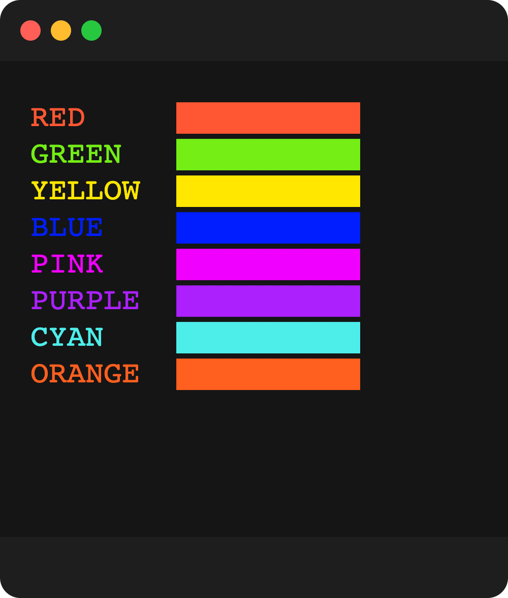
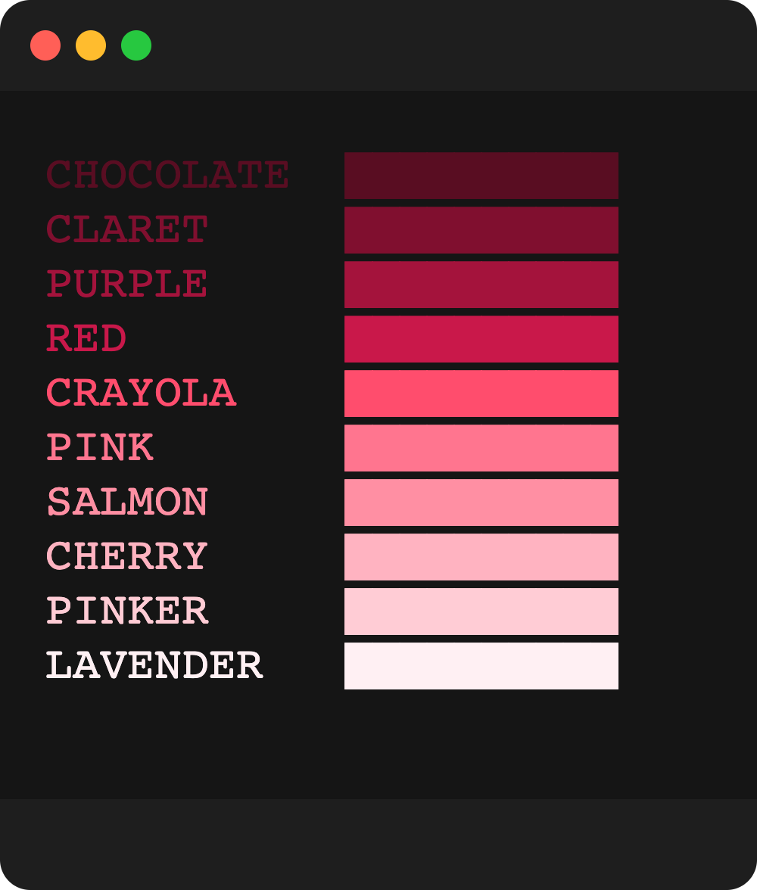
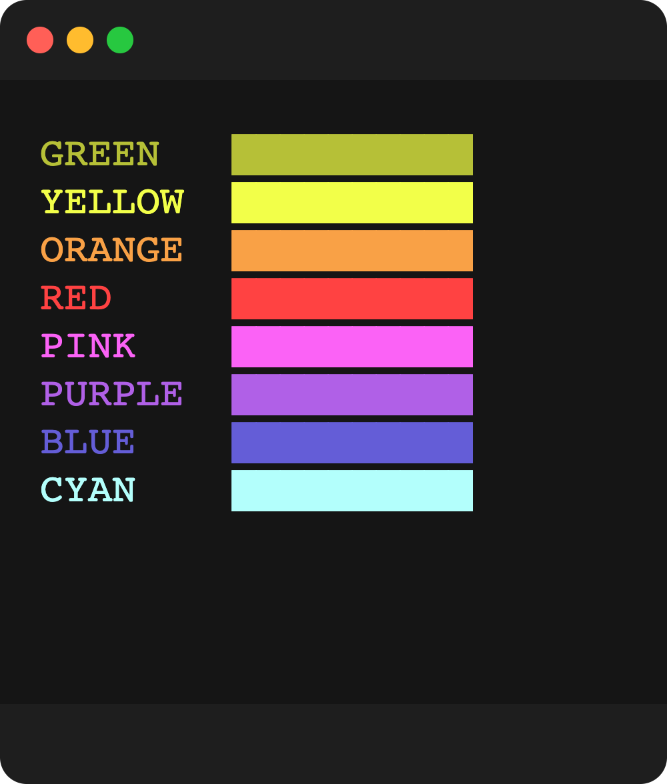
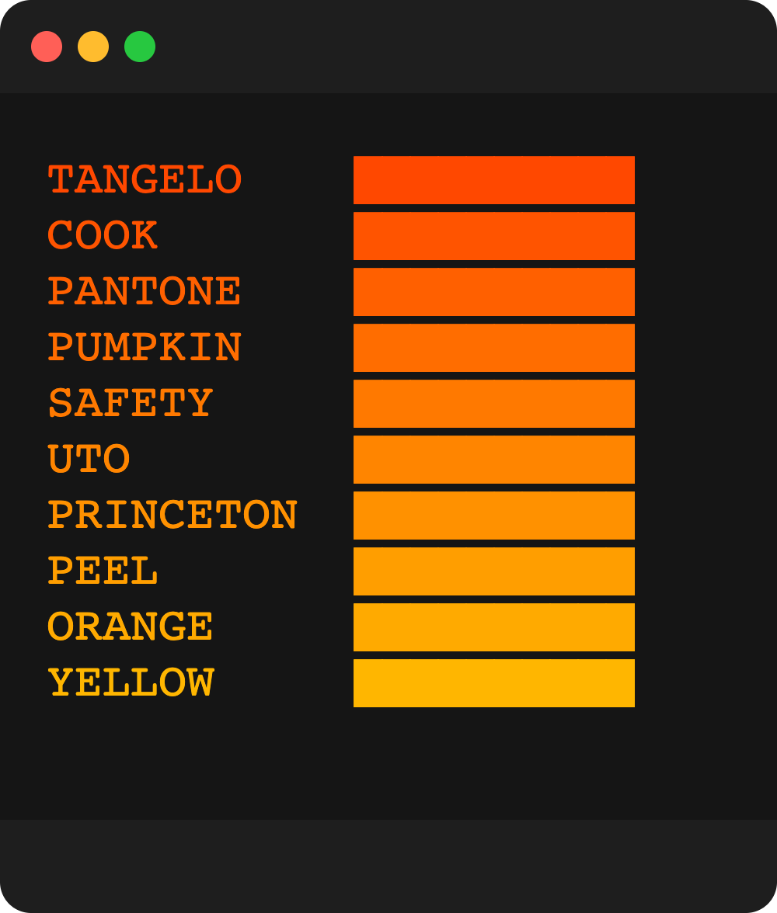

# styl3 3.0

themeable cli coloring

# What's New

✅ 20 built-in [themes](#themes)!  
✅ Formatting [decorators](#decorators)!  
✅ Supports custom colors and custom themes!  
✅ Supports hex, rgb, or ansi color codes  
✅ Color conversion utils such as rgb/hex/ansi  
✅ Easy and flexible api

## usage

`styl3` can provide color names as functions for coloring output and decorators for adding specific formatting for a given string.  
for example:

```typescript
import style from "styl3";

const styled = style();

const output = [
  "@*Never* gonna give you !up!@",
  "@Never gonna %let you down%@",
  "@$Never$ gonna run around and *desert* you@"
];
```


```javascript
const style = require("styl3");
const s = style();

console.log(s.red`this will be a default red`);
// access a theme specifically
console.log(s.pastel.green`this will be a pastel green`);

const ss = style({ theme: "pastel" });
// now `ss.green` points to the pastel green

console.log(ss.green`also a pastel green`);

// supports custom hex
console.log(ss.hex("#de5285")`this will be a slick pink`);
// and rgb
console.log(ss.rgb(15, 106, 251)`this will be a rich blue`);
```


# decorators

decorators are characters used to wrap a word and give it decorating features,
such as bold, italic, underline, strikeout, inverted and italic.

more than one decorator can be applied to a word

## map

```javascript
{
  bold: '*',
  underline: '!',
  dim: '~',
  hidden: '#',
  invert: '@',
  blink: '^',
  italic: '%',
  strikeout: '$'
}
```

## usage

```javascript
const style = require("styl3");
const s = style({ theme: "pastel" });

// use decorators for bold, underline etc...
console.log(s.red`lush red *BOLD* @INVERTED@`);
// double decoratros
console.log(s.cyan`this is !*bolderlined!*! get it? bold and underlined...😏`);
console.log(s.green`viva la %italic%`);
console.log(s.pink`address: ~you@somewhere.earth~`);
```


you can also provide your own custom decorators map:

```javascript
const style = require("styl3");
const s = style({ theme: "pastel", decorators: { bold: "_" } });

// use custom decorators
console.log(s.red`this will now be _BOLD_`);
```

you can also provide your own color theme:

```javascript
const style = require("styl3");
const custom = style({
  theme: "custom",
  colors: {
    custom: {
      red: "#750404",
      green: "#1b7504",
      yellow: "#929605",
      blue: "#041382",
      purple: "#620182",
      cyan: "#027678",
      pink: "#a3039b",
      orange: "#b37202"
    }
  }
});

// use custom colors
console.log(s.green`this will be with #1b7504 color`);
```

# themes

15 unique built-in themes to get you started on easy cli styling  
[](https://github.com/tool3/shellfie)

| Theme     | Screenshot                            |
| --------- | ------------------------------------- |
| autumn    |     |
| beach     |      |
| champagne |  |
| crayons   |    |
| lush      |       |
| mint      |       |
| nature    |     |
| neon      |       |
| pastel    |     |
| pinkish   |    |
| pool      |       |
| rainbow   |    |
| rufus     |      |
| sport     |      |
| spring    |     |
| summer    |     |
| sunset    |     |
| vintage   |    |
| standard  |   |
| default   |    |
